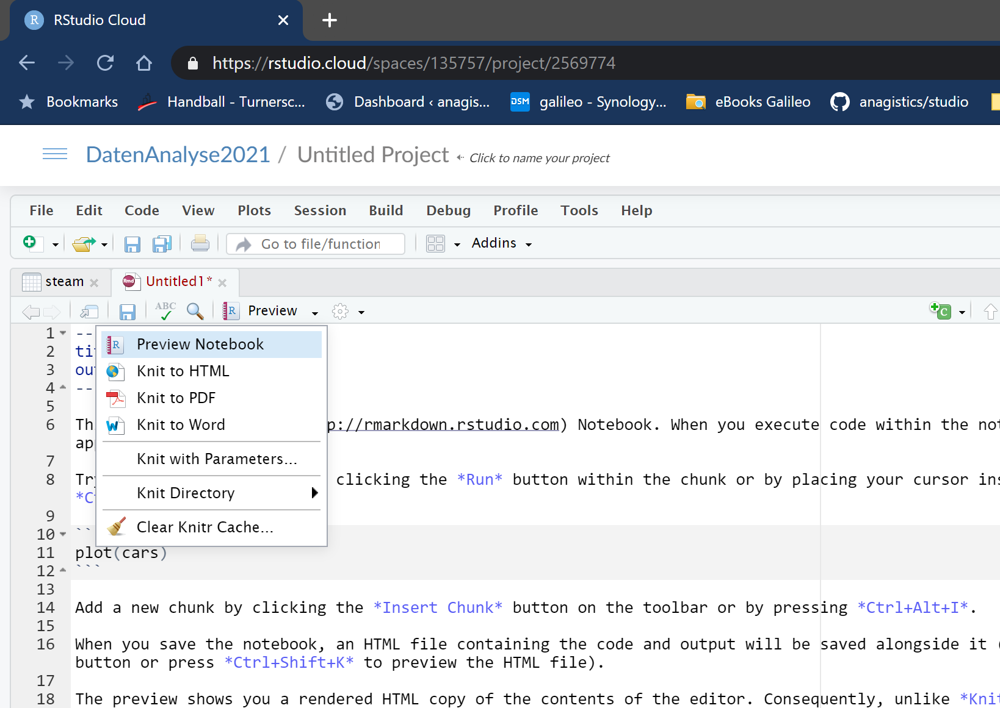

# Einführung

Diese kleine Einführung in R orientiert sich am bekannten Ablauf von Datenprojekten:

```{r img-process, echo=FALSE, fig.align = 'center', out.width = "80%", fig.cap = "Quelle: R for Data Science"}

knitr::include_graphics("./img/data-science-explore.png")
```

Zu jedem der 6 Hauptschritte gibt es ein Kapitel mit Codebeispielen zu typischen Arbeitsschritten. In den eigenen Projekten können diese Beispiele als Vorlage dienen. Grundsätzlich empfehle ich, in einem eigenen Projekt zu arbeiten und dort eine *R Markdown*-Datei anzulegen.

## Projekt und Notebook anlegen

In dieser Einführung gehe ich davon aus, dass Sie mit *RStudio Cloud* arbeiten - RStudio als Desktop-Anwendung auf dem eigenen Rechner funktioniert aber ebenso. Ein neues Projekt erreicht man, indem man in RStudio-Cloud zunächst mittels `New Project` ein neues Projekt anlegt (in RStudio Desktop kann man dies über `File | New Project...` erreichen). Wechselt man in dieses Projekt, legt man über `File | New File... | R Notebook` eine sog. *Notebook*-Datei an. In diesem Format kann man einerseits Text schreiben und über die Auszeichnungssprache *Markdown* formatieren und andererseits Code-Abschnitte einfügen und die Ausgaben der Ausführung in das Dokument aufnehmen. Das initial von RStudio angelegte Dokument enthält direkt eine kleine Anleitung und Übersicht über die Möglichkeiten im Anschluss an einen Dokumentkopf zwischen zwei `---`-Zeilen. Ich empfehle, diese Kurzanleitung einmal durchzulesen und nachzuvollziehen und dann zu löschen.

Über die im Einführunstext auch beschriebene Tastenkombination `Alt + Strg + I` wird ein neuer Code-Abschnitt (*Chunk*) für R in das Dokument eingefügt. Code, der innerhalb eines solchen Abschnitts eingefügt wird, kann direkt über den kleinen grünen Pfeil in der rechten oberen Ecke des Chunks ausgeführt werden. Das `Run`-Menü im Dokumentenfenster enthält zahlreiche Befehle für die Ausführung von Code-Chunks.

```{r rs-run-chunks, echo=FALSE, fig.align = 'center', out.width = "80%", fig.cap = "Kommandos zur Code-Ausführung"}

knitr::include_graphics("./img/rstudio-run-commands.png")
```

Aus einem Notebook erzeugt RStudio ein veröffentlichbares Dokument in wählbaren Formaten. Dieser Vorgang wird *knitting* genannt, weil hier verschiedene Quellen (Text, Code, ggf. noch `HTML` und `CSS`) zu einem Ergebnis *verstrickt* werden.

```{r rs-knit, echo=FALSE, fig.align = 'center', out.width = "80%", fig.cap = "Ausgabe des Dokuments in verschiedenen Formaten"}


```

Im `Help`-Menü gibt es Hilfe zu den Möglichkeiten von Markdown unter dem Eintrag `Markdown Quick Reference`. Über das Untermenü `Cheatsheets` können weitere PDF-Dateien mit kompakten Befehlsübersichten und -erklärungen heruntergeladen werden.

# Daten laden

# Datensätze verbinden

# Daten sichten, sortieren und filtern

# Daten transformieren

# Daten aggregieren

# Visualisieren

# Modellierung

---
# Online R lernen

Hier eine Reihe von Videos bzw. Webseiten, die beim Erlernen von R hilfreich sein können:

`r emo::ji("backhand index pointing right")` [Datenanalyse mit R, HS Kaiserslautern](https://www.youtube.com/watch?v=eNl7m9iJwSQ)

`r emo::ji("backhand index pointing right")` Cheatsheets und Primer in RStudio Cloud

`r emo::ji("backhand index pointing right")` [YouTube Kanal *Statistik am PC*](https://www.youtube.com/c/StatistikamPC_BjoernWalther/playlists)

`r emo::ji("backhand index pointing right")` [Crashkurs *Programmieren in R*](https://datentaeter.de/crashkurs-programmieren-in-r-fuer-journalismus-rstudio-coden-datenjournalismus-installation-tutorial/) 

`r emo::ji("backhand index pointing right")` [Datenanalyse in R  1](http://christopherharms.de/stuff/r-workshop/R-Workshop_UniBonn_Tag1.pdf)

`r emo::ji("backhand index pointing right")` [Datenanalyse in R  2](http://christopherharms.de/stuff/r-workshop/R-Workshop_UniBonn_Tag2.pdf)
