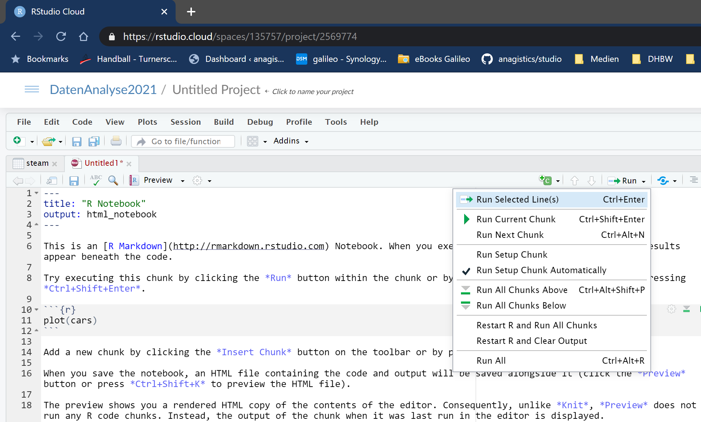

```{css include=FALSE}
.boxone {
  padding: 1em;
  background: lightblue;
  color: black;
  border: 1px solid blue;
  border-radius: 5px;
}

.center {
  text-align: center;
}
```


# Einführung

Diese kleine Einführung in R orientiert sich am bekannten Ablauf von Datenprojekten:

```{r img-process, echo=FALSE, fig.align = 'center', out.width = "80%", fig.cap = "Quelle: R for Data Science"}

knitr::include_graphics("./img/data-science-explore.png")
```

Zu jedem der 6 Hauptschritte gibt es ein Kapitel mit Codebeispielen zu typischen Arbeitsschritten. In den eigenen Projekten können diese Beispiele als Vorlage dienen. Grundsätzlich empfehle ich, in einem eigenen Projekt zu arbeiten und dort eine *R Markdown*-Datei anzulegen. Ein kurzes 1minütiges Video zu R Markdown findet sich unter [https://vimeo.com/178485416](https://vimeo.com/178485416).

## Projekt und Notebook anlegen

In dieser Einführung gehe ich davon aus, dass Sie mit *RStudio Cloud* arbeiten - RStudio als Desktop-Anwendung auf dem eigenen Rechner funktioniert aber ebenso. Ein neues Projekt erreicht man, indem man in RStudio-Cloud zunächst mittels `New Project` ein neues Projekt anlegt (in RStudio Desktop kann man dies über `File | New Project...` erreichen). Wechselt man in dieses Projekt, legt man über `File | New File... | R Notebook` eine sog. *Notebook*-Datei an. In diesem Format kann man einerseits Text schreiben und über die Auszeichnungssprache *Markdown* formatieren und andererseits Code-Abschnitte einfügen und die Ausgaben der Ausführung in das Dokument aufnehmen. Das initial von RStudio angelegte Dokument enthält direkt eine kleine Anleitung und Übersicht über die Möglichkeiten im Anschluss an einen Dokumentkopf zwischen zwei `---`-Zeilen. Ich empfehle, diese Kurzanleitung einmal durchzulesen und nachzuvollziehen und dann zu löschen.

Über die im Einführunstext auch beschriebene Tastenkombination `Alt + Strg + I` wird ein neuer Code-Abschnitt (*Chunk*) für R in das Dokument eingefügt. Code, der innerhalb eines solchen Abschnitts eingefügt wird, kann direkt über den kleinen grünen Pfeil in der rechten oberen Ecke des Chunks ausgeführt werden. Das `Run`-Menü im Dokumentenfenster enthält zahlreiche Befehle für die Ausführung von Code-Chunks.

```{r rs-run-chunks, echo=FALSE, fig.align = 'center', out.width = "80%", fig.cap = "Kommandos zur Code-Ausführung"}


```

Aus einem Notebook erzeugt RStudio ein veröffentlichbares Dokument in wählbaren Formaten. Dieser Vorgang wird *knitting* genannt, weil hier verschiedene Quellen (Text, Code, ggf. noch `HTML` und `CSS`) zu einem Ergebnis *verstrickt* werden.

```{r rs-knit, echo=FALSE, fig.align = 'center', out.width = "80%", fig.cap = "Ausgabe des Dokuments in verschiedenen Formaten"}

knitr::include_graphics("./img/rstudio-knit-commands.png")
```

## Pakete

Wie andere Sprachen auch, bietet R eine Vielzahl von Funktionen (und Daten) in Paketen (in anderen Sprachen spricht man von Bibliotheken oder Modulen). Diese Pakete müssen zunächst installiert werden und werden dann nach Bedarf über die Funktion `library` geladen und verfügbar gemacht. Die häufigste Quelle von Paketen ist das [`CRAN`](https://cran.r-project.org/) (*Comprehensive R Archive Network*). Diese Quelle ist in RStudio für den Menüpunkt `Tools | Install Packages...` voreingestellt und auch die Funktion `install.packages` sucht Pakete standardmäßig dort. Der folgende Code lädt bspw. das verbreitete Paket `tidyverse`:

```{r}
library(tidyverse)
```

Wie man an der Ausgabe sieht, handelt es sich bei `tidyverse` eigentlich um ein Paket von Paketen - die Pakete `ggplot2`, `dplyr`, `purrr` usw. könnten auch einzeln per `library`-Aufruf geladen werden. Aber man benötigt häufig Funktionen aus dieser Paketfamilie und damit ist der obige Aufruf einfacher.

## Hilfe

Sowohl die Basisinstallation von R als auch die Pakete bieten eine Hilfe an, die in RStudio im `Help`-Panel angezeigt wird. Benötigt man für ein Kommando `cmd` eine Hilfe, kann man in der Konsole (`Console`-Panel) über `?cmd` eine Hilfeseite aufrufen. Zugegebenermaßen ist diese Hilfeseite nicht immer ganz einfach zu verstehen, weil sie doch recht kompakt ist und gerade komplexere Kommandos eher kurz abgehandelt werden. Mit `??cmd` kann die Hilfe zu Einträgen zu `cmd` durchsucht werden.

Im `Help`-Menü gibt es weiterhin Hilfe zu den Möglichkeiten von Markdown unter dem Eintrag `Markdown Quick Reference`. Über das Untermenü `Cheatsheets` können weitere PDF-Dateien mit kompakten Befehlsübersichten und -erklärungen heruntergeladen werden.

# Daten laden

R bietet viele Pakete und Funktionen, um Daten aus den verschiedensten Quellen zu laden, bspw.  SQL-Datenbanken, SAS-Dateien, Excel XLSX und XLS-Dateien, CSV, JSON, HDF5, Apache Arrow uvm.

Eine XLSX-Datei mit dem Namen `Telco_customer_churn.xlsx` im Ordner `data` lässt sich mit der Funktion `read_xlsx` aus dem `readxl`-Paket laden:

```{r}
library(readxl)

churn <- read_xlsx("data/Telco_customer_churn.xlsx")
```

Im Code oben werden die Daten über den Zuweisungsoperator `<-` der Variable `churn` zugewiesen. Es ist in R nicht nötig, Variablen zu deklarieren und explizit einen Datentyp anzugeben. Über die Funktion `class` erhält man eine Aufzählung der von einer Variablen geerbten Klassen (in dieser Einführung gehe ich nicht auf die verschiedenen Objektsysteme von R ein).

```{r}
class(churn)
```

Das Ergebnis listet u.a. `data.frame` auf: Dies ist eine Datenstruktur für Datentabellen, d.h. eine Liste von Spalten mit Werten eines Datentyps. Die Funktion `names` liefert die Namen der Spalten der Datentabelle:

```{r}
names(churn)
```

Auf die einzelnen Spalten kann man mit dem `$`-Operator zugreifen. Die Funktion `head` beschränkt die Ausgabe auf die ersten paar Elemente:
```{r}
head(churn$CustomerID)
```

# Datensätze verbinden

Sehr häufig steht man vor der Aufgabe, zwei oder mehrere Datensätze anhand eines Schlüsselfelds zu verbinden. Aus SQL kennt man dafür die *join*-Operationen und genau diese Operationen stehen auch über entsprechende Funktionen in `dplyr` zur Verfügung. Im Unterschied zu SQL, kann man in `dplyr` derzeit nur sog. *Equi-Joins* durchführen, d.h. Joins, bei denen die Werte der Schlüsselfelder gleich sind. Man muss sich dann hier mit Hilfsfeldern, s. unten bei *Datensätze transformieren*, behelfen. Im folgenden Beispiel wird zunächst ein weiterer Datensatz geladen und anschließend wird ein *inner join* durchgeführt:

```{r}
status <- read_xlsx("data/Telco_customer_churn_status.xlsx")

ch <- churn %>% inner_join(status, by = c("CustomerID" = "Customer ID"))

names(ch)
```

An diesem Beispiel kann man mehrere Dinge sehen:

1. Die Schlüsselfelder heißen in den zwei Datensätzen verschieden: Der Parameter `by` bekommt einen Vektor (konstruiert durch die Funktion `c()`) übergeben, bei dem der Join-Schlüssel des linken Datensatzes der Feldname `CustomerID` ist und der Join-Schlüssel des rechten Datensatzes dessen Wert `Customer ID` entspricht.
1. Sind in den Datensätzen gleichnamige Felder enthalten, bekommen diese im Ergebnisdatensatz ein Suffix, das standardmäßig `.x` für den linken und `.y` für den rechten Datensatz ist.

Neben `inner_join`, stehen auch `left_join`, `right_join`, `outer_join` und `anti_join` zur Verfühung. Letzteres entfernt Datensätze aus dem linken Datensatz, für die das Joinkriterium zutrifft.


# Daten sichten, sortieren und filtern

Um sich einen ersten Überblick über Daten zu verschaffen kann man die Befehle `summary` und `glimpse` verwenden:
```{r}
summary(churn)
```

`summary` lässt sich auch sinnvoll auf eine einzelne Spalte anwenden, bspw.:
```{r}
summary(churn$`Monthly Charges`)
```


```{r}
glimpse(churn)
```
Für das Sichten, Sortieren, Filtern und weitere Operationen gibt es in R verschiedene Möglichkeiten und grundsätzlich sind diese Operationen natürlich auch ohne Zusatzpakete möglich. Allerdings empfehle ich hier aus Gründen der Lesbarkeit und der Kombinierbarkeit mit weiteren Operationen (s. unten) die Funktionen aus dem `dplyr`-Paket bzw. allgemein aus `tidyverse`: Auswahl von Spalten mittels `select` analog zu SQL, Sortieren mittels `arrange` und Filtern mit der Funktion `filter`. Zudem bietet es sich an, den *Pipe*-Operator `%>%` (definiert im Paket `magrittr`) zu verwenden. Dieser Operator ist im Grunde zwar nur *syntactic sugar*, sorgt aber für eine sehr klare Struktur von Datenverarbeitungsschritten.[^1]

[^1]: `%>%` funktioniert folgendermaßen: Anstelle von `meine_funktion(a,b)` schreibt man `a %>% meine_funktion(b)`. Damit erreicht man eine bessere Lesbarkeit: Anstelle von `schritt_2(schritt_1(daten))` schreibt man `daten %>% schritt_1 %>% schritt_2` und dokumentiert quasi automatisch den Ablauf mit der Syntax. Ab R v4.1 gibt es nativ in der Sprache den Pipe-Operator `|>`, der vergleichbar mit dem Pipe-Operator `|` der C++ 20 Ranges ist. 

```{r echo=TRUE}
selection <- churn %>% 
  filter(`Payment Method` == "Electronic check") %>% 
  arrange(`Tenure Months`) %>% 
  select(City, Gender, `Tenure Months`)
```

Im obigen Statement wird das Ergebnis der Filterung, Sortierung und Spaltenauswahl der neuen Variablen `selection` zugewiesen. Mit dieser kann dann ggf. weitergearbeitet werden.

Möchte man in absteigender Reihenfolge sortieren, setzt man das entsprechende Argument in `desc(...)` ein:
```{r}
churn %>% 
  arrange(desc(`Total Charges`), `Zip Code`) %>% 
  select(`Total Charges`, `Zip Code`) %>% 
  head(10)
```

Filterkriterien sind logische Ausdrücke und können die bekannten Operatoren `==`, `!=`, `<`, `>`, `<=` und `>=` sowie `%in%` umfassen und mit `&` bzw. `|` und Klammerung kombiniert werden.

# Daten transformieren

Möchte man neue Spalten hinzufügen, ändern oder löschen verwendet man die Funktion `mutate`:
```{r}
crp <- churn %>% mutate(REGION = floor(`Zip Code` / 1000), 
                        Country = NULL,
                        `Phone Service` = if_else(`Phone Service` == "Yes", 1, 0)) %>% 
  select(CustomerID, REGION, `Phone Service`) %>% 
  head(10)
```

Das obige Statement führt drei Transformationen durch:

1. Eine neue Spalte `REGION` wird angelegt, die grob aus der Postleitzahl eine Region ableitet,
1. die Spalte `Country` wird gelöscht (weil dort immer derselbe Wert *United States* drin steht),
1. die Spalte `Phone Service` wird umgewandelt von einer *Yes/No*-Codierung der Kategorie in eine numerische 1/0-Codierung. Damit kann dann später leichter gerechnet werden. Hilfreich ist hierbei die `if_else`-Funktion, die (ähnlich wie in Excel) eine if-else-Verzweigung als Funktion anbietet.

# Daten aggregieren

Aus SQL sind Aggregatfunktionen wie `count`, `mean`, `max` usw. bekannt, die entsprechende Kennzahlen (zumeist) auf gruppierten Daten ausrechnen. Ähnlich funktioniert dies mit `dplyr`:
```{r}
churn %>% 
  group_by(City) %>%
  summarise(N = n(), AVG_CHARGE = mean(`Total Charges`), N_ZIP = n_distinct(`Zip Code`)) %>%
  arrange(desc(N)) %>% 
  head(10)
```

Hier werden die Daten des `churn`-Datensatzes zunächst nach dem Merkmal `City` gruppiert und anschließend werden über die Funktion `summarise` verschiedene Aggregate bestimmt. Die Funktion `n()` bestimmt die Zahl der Datensätze, die Funktion `mean` den Mittelwert des Merkmals `Total Charge` (also einen mittleren Rechnungsbetrag) und mit `n_distinct` wird die Zahl der verschiedenen Postleitzahlen pro Gruppe, d.h. `City`, bestimmt: `n_distinct` zählt also Duplikate nicht mit. Weitere wichtige Funktionen für Datenanalysen sind: `sd` (Standardabweichung), `var` (Varianz), `quantile` (berechnet über ein weiteres Argument verschiedene Quantile), `median` für den Median. 

Was leicht passieren kann: Anstelle von `summarise` (oder auch `summarize`) schreibt man aus Versehen `summary` (wie oben): Syntaktisch nicht falsch, aber das Ergebnis ist nicht wie erwartet.

Man kann auch, wie in SQL, über mehrere Merkmale gruppieren:
```{r}
churn %>% 
  group_by(City, `Zip Code`) %>%
  summarise(N = n(), AVG_CHARGE = mean(`Total Charges`)) %>%
  arrange(desc(N)) %>% 
  head(10)

```


# Visualisieren

Für einfache Diagramme zur schnellen Prüfung von Zusammenhängen bieten sich die R-Funktionen `plot` für Scatterplots und `hist` für Histogramme an. Einige weitere Pakete bieten auch `plot`-Funktionen an, so dass es sehr oft die Möglichkeit gibt, Daten oder eine Struktur (bspw. ein Entscheidungsbaum) mittels `plot` zu visualisieren. Die konkrete Syntax kann über `?plot` bzw. `?hist` nachgeschlagen werden.

Die Standard-Graphiken erreichen nicht den Anspruch für Veröffentlichungen (Dokumentation, Präsentation). Dafür sollte man auf andere Pakete zurückgreifen, bspw. `ggplot2`, `plotly` oder `highcharter`. Zu `tidyverse` gehört `ggplot2`, wobei das `gg` für *grammar of graphics* steht und auf ein Buch von Leland Wilkinson, *The Grammar of Graphics*, zurückgeht. Die Idee dahinter ist es, Graphiken ähnlich wie Sätze aus einzelnen Elementen nach bestimmten Regeln zusammenstellen und auf diese Weise Daten bzw. Werte visuellen Eigenschaften wie Farbe, Form, Position usw. zuzuweisen.

`ggplot2` ist ein sehr mächtiges Paket und ich kann hier nicht die ganzen Möglichkeiten darstellen: Ein Blick auf das `ggplot2`-Cheatsheet verschafft aber schon einen guten Überblick. Wichtig sind die Funktionen `ggplot` für das Festlegen der hauptsächlichen Datenzuordnung, `aes` für die Zuordnung von Merkmalen zu wesentlichen visuellen Attributen und die verschiedenen `geom_*`-Funktionen für die Chartform. Es gibt daneben noch zahlreiche weitere Funktionen für die Gestaltung von Achsen, Beschriftungen, Legenden usw.

Beispiele für die Erstellung von Graphiken finden sich auch in den Vorlesungsunterlagen. An dieser Stelle daher ein Beispiel, das Datenaufbereitung mit Graphikausgabe verbindet. Die Bedeutung der Zeilen wird durch Kommentare im Code erklärt:
```{r}
churn %>% 
  group_by(City) %>% 
  summarise(MITTLERE_RECHNUNG = mean(`Total Charges`), 
            MEDIAN_RECHNUNG = median(`Total Charges`)) %>% 
  filter(MITTLERE_RECHNUNG > 2000) %>%
  # nur die bzgl. des Merkmales MITTLERE_RECHNUNG 20 höchsten Datensätze nehmen:
  top_n(n = 20, wt = MITTLERE_RECHNUNG) %>%  
  # Start der Graphik und Zuordnung der wesentlichen Attribute: x entspricht der unabh. Variablen
  # und die unabh. Werte werden umsortiert entsprechend des Merkmales MITTLERE_RECHNUNG:
  ggplot(aes(x = reorder(City, MITTLERE_RECHNUNG))) + # Zusammensetzen der Graphik mit '+'
  # Säulendiagramm für die mittlere Rechnungshöhe. Die Füllfarbe ist nicht datenabhängig und wird 
  # daher außerhalb der aes-Funktion gesetzt:
  geom_col(aes(y = MITTLERE_RECHNUNG), fill = "darkgreen") + 
  # Punkt in Form von gelben Rauten für den Medianwert:
  geom_point(aes(y = MEDIAN_RECHNUNG), shape = "diamond", color = "yellow") +
  # Ein Texthinweis zur Erklärung der Medianwerte, Koordinaten hart codiert:
  annotate(geom = "label", x = "Piercy", y = 6500, label = "Median", vjust = 0) +
  # Vertauschen von x und y-Achse gegenüber der normalen Darstellung:
  coord_flip() + 
  # Beschriftungen:
  labs(title = "Mittlere Rechnungshöhe pro Stadt", subtitle = "für mittlere Rechnungshöhe > 2000",
       x = "Stadt", y = "mittlere Rechnungshöhe") +
  # Weitere Formatierungen, hier des Chart-Hintergrunds:
  theme(panel.background = element_rect(fill = "darkgray"))
  
```

# Modellierung

In dieser Einführung wird ein Entscheidungsbaum mit Hilfe des Pakets `tree` berechnet. Konkret wird ein Klassifikationsmodell auf dem *churn*-Datensatz berechnet. Die abhängige Variable ist *Churn Value* und als unabhängige Variablen werden *Tenure Months*, *Internet Service*, *Phone Service* und *Monthly Charges* gewählt (das ist nicht unbedingt die beste Wahl, hier geht es aber nur um den Weg). 

Zunächst ändere ich aber die Spaltennamen in Bezeichner, die sich auch ohne Anführungszeichen schreiben lassen und gültigen R Bezeichnern entsprechen:

```{r}
library(vctrs)

names(churn) <- vec_as_names(names(churn), repair = "universal")
```

Für das Training des Modells wähle ich hier den einfacheren Einsatz und teile den Datensatz zufällig in einen Trainings- und einen Testdatensatz auf. Zusätzlich ändere ich die Textspalten in kategorielle Variablen (`factor` in R).

```{r}
mbase <- churn %>%
  select(Churn.Value, Tenure.Months, Internet.Service, Phone.Service, Monthly.Charges) %>% 
  mutate(INDICATOR = runif(n = nrow(.)),
         CHURN = as.factor(Churn.Value),
         INTERNET = as.factor(Internet.Service),
         PHONE = as.factor(Phone.Service)) %>% 
  select(-Internet.Service, -Phone.Service, -Churn.Value)

train <- mbase %>% filter(INDICATOR > 0.2) %>% select(-INDICATOR)
test <- mbase %>% filter(INDICATOR <= 0.2) %>% select(-INDICATOR)
```

Es gibt in R durchaus mehrere Pakete, die Frameworks für die Datenaufbereitung und Durchführung der Modellbildung für maschinelles Lernen bieten. Dort finden sich dann auch Funktionen zum direkten Aufteilen der Daten in Trainings- und Testmengen. Der oben gewählte Ansatz ist eine eher rudimentäre Lösung, die zunächst jedem Datensatz per `runif` eine gleichverteilte Zufallszahl zuordnet, um auf dieser dann im zweiten Schritt zu filtern.

Im nächsten Schritt trainieren wir das Modell und rufen dazu geeignete Funktionen aus dem Paket `tree` auf:
```{r}
library(tree)

model <- tree(CHURN ~ Tenure.Months + Monthly.Charges + INTERNET + PHONE,
              data = train)
```

Eine erste Bewertung des Modells gibt hier die `summary`-Funktion, die u.a. die *Fehlklassifikationsrate* angibt:
```{r}
summary(model)
```

Mehr über den Entscheidungsbaum selbst läßt sich über eine Visualisierung erfahren:
```{r}
plot(model)
text(model, pretty = 0)
```

Die Ausgabe ist nicht sonderlich hübsch, aber funktional (für *hübsch* gibt es, natürlich, noch andere Wege). Zu lesen ist jeder Entscheidungsknoten so: Die Bedingung steht an der Verzweigung und der linke Ast entspricht `TRUE` und der rechte `FALSE`. Bei *INTERNET: DSL, No* bedeutet also der rechte Ast, dass es um einen DSL-Anschluss geht (nicht *No*). 

Um den Entscheidungsbaum aber richtig bewerten zu können, muss das Model am Testdatensatz beurteilt werden:
```{r}
pred <- predict(model, test, type = "class")
```

Anhand einer Konfusionsmatrix aus den bekannten Werte aus `test` mit den soeben vorhergesagten lässt sich die Güte des Modells und die Fähigkeit zur Generalisierung besser ableiten:

```{r}
table(test$CHURN, pred, dnn = c("Wahrheit", "Vorhersage"))
```

Man sieht, die Richtig-Negativ-Rate ist recht ordentlich, die Richtig-Positiv-Rate jedoch schlecht. Aus dieser Tabelle lassen sich jedenfalls die aus der Vorlesung bekannten Gütekriterien ermitteln. 

<span class="center boxone">
So viel zur Einführung in R mit einem Schwerpunkt auf die Inhalte meiner Veranstaltungen an der DHBW Stuttgart. 
</span>

---

# Literatur & Quellen

**[1]** Sebastian Sauer: Moderne Datenanalyse mit R, Springer Gabler, 2019

**[2]** Gareth James, Daniela Witten, Trevor Hastie, Robert Tibshirani: An Introduction to Statistical Learning with Applications in R, Springer, 2013. Online erhältlich unter [https://www.statlearning.com/](https://www.statlearning.com/).

**[3]** Steven S. Skiena: The Data Science Design Manual, Springer, 2017

---
# Online R lernen

Hier eine Reihe von Videos bzw. Webseiten, die beim Erlernen von R hilfreich sein können:

`r emo::ji("backhand index pointing right")` [Datenanalyse mit R, HS Kaiserslautern](https://www.youtube.com/watch?v=eNl7m9iJwSQ)

`r emo::ji("backhand index pointing right")` Cheatsheets und Primer in RStudio Cloud

`r emo::ji("backhand index pointing right")` [YouTube Kanal *Statistik am PC*](https://www.youtube.com/c/StatistikamPC_BjoernWalther/playlists)

`r emo::ji("backhand index pointing right")` [Crashkurs *Programmieren in R*](https://datentaeter.de/crashkurs-programmieren-in-r-fuer-journalismus-rstudio-coden-datenjournalismus-installation-tutorial/) 

`r emo::ji("backhand index pointing right")` [Datenanalyse in R  1](http://christopherharms.de/stuff/r-workshop/R-Workshop_UniBonn_Tag1.pdf)

`r emo::ji("backhand index pointing right")` [Datenanalyse in R  2](http://christopherharms.de/stuff/r-workshop/R-Workshop_UniBonn_Tag2.pdf)
