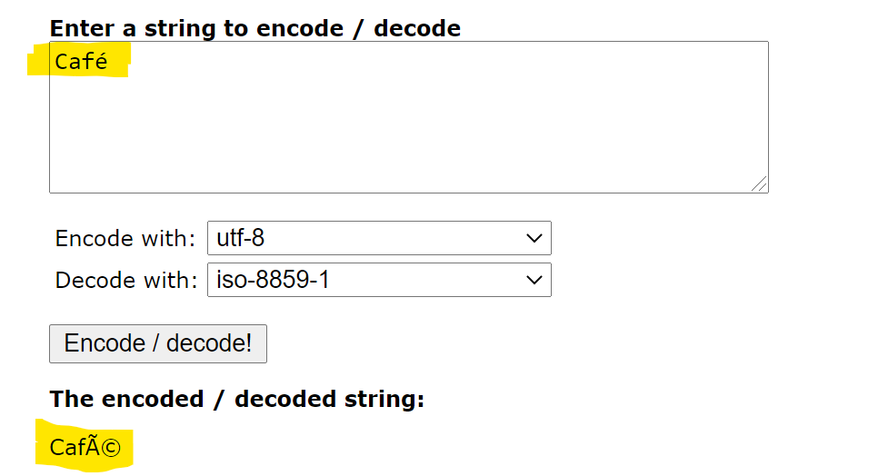
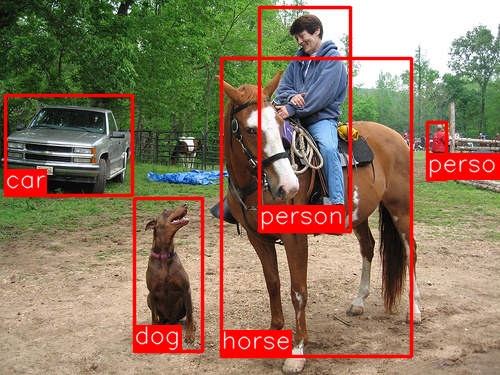
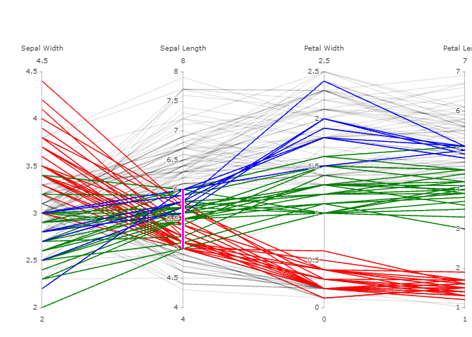
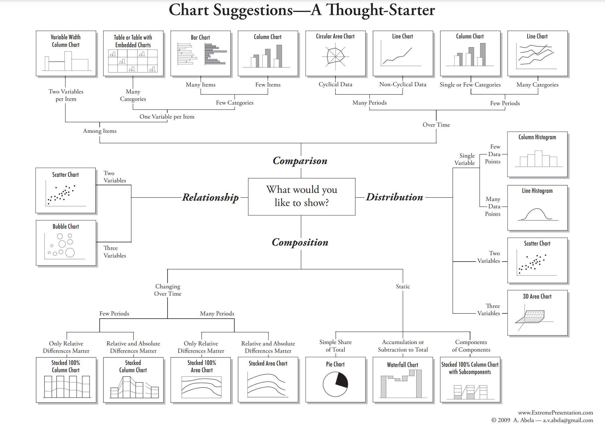
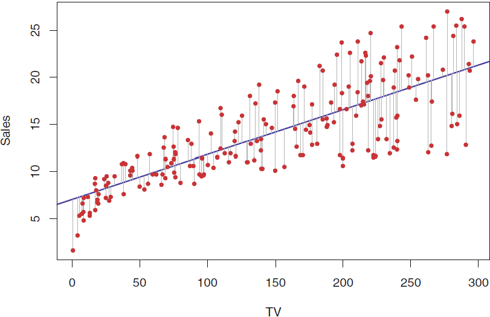

```{css, echo = FALSE}
.exercise {
  background-color: #0048BA;
  color: #d6d6d6;
  text-shadow: 0 0 20px #333;
}

.exercise h1, .exercise h2, .exercise h3 {
  color: #f3f3f3;
}

.small {
  font-size: 80%;
}

```

```{r setup, include=FALSE}
options(htmltools.dir.version = FALSE)

library(emo)
library(kableExtra)
library(ggalluvial)
library(tidyverse)
library(easyalluvial)
library(dataMaid)
library(here)

# Daten kommen von: https://www.kaggle.com/blastchar/telco-customer-churn 

telco_data <- readr::read_csv("./telco_dataset.csv")

```


# Plan Tag `r emo::ji("one")`

.pull-left[
* Was ist Datenanalyse und 
   * was hat das mit Versicherungen zu tun?
* Der Prozess der Datenanalyse 
* Datenquellen (in VU)
* Datenschutz
* Datenquellen lesen
]

.pull-right[
* Daten verstehen: Struktur, Validierung + `r emo::ji("worker")` 
* Visualisierung + `r emo::ji("worker")` `r emo::ji("worker")`
* Herangehensweise: Hypothesenbildung + `r emo::ji("worker")` `r emo::ji("worker")`
* Modellierung
* Datenanalyse per Code
* Reproduzierbarkeit der Datenanalyse + `r emo::ji("worker")` `r emo::ji("worker")`
]

---
# Plan Tag `r emo::ji("two")`

`r emo::ji("home")` `r emo::ji("one")` $\rightarrow$ `r emo::ji("two")`: Anmeldung `RStudio Cloud` + Video Einführung in `R`

* Fragen zum technischen Setup
* `r emo::ji("worker")` `r emo::ji("worker")` `r emo::ji("microscope")`: Praxis Datenanalyse


---
class: inverse, center, middle

# Datenanalyse in Versicherungsunternehmen?

Kennen Sie Anwendungsfälle? Haben Sie eigene Erfahrungen?


---
# Der Prozess der Datenanalyse

1. Die richtigen Fragen finden: Was möchte ich eigentlich wissen?
2. Die eigentliche Datenanalyse:

   

Quelle: [*R for Data Science*](https://r4ds.had.co.nz/explore-intro.html)

Der Punkt *Model* in obiger Graphik bezieht sich auf Datenanalyse im Kontext von *Data Science*, wenn es darum geht, aus den Daten deskriptive oder prädiktive Modelle abzuleiten.


---
# Daten extrahieren

* *Datenextraktion*: Beziehen der Daten aus den verschiedenen Datenquellen.

`r emo::ji("question")` Woher beziehen wir eigentlich Daten?


---
# Datenquellen in VU (1)

* Datenbanken - strukturierte Daten
  * OLTP<sup>1</sup>-Systeme z.B. für die Vertragsverwaltung, Zahlvorgänge, Finanzbuchungen
  * OLAP<sup>2</sup>-Systeme für Reporting (Berichtswesen): Bilden die technische Grundlage für  BI<sup>3</sup>-Systeme
  
Meistens werden *relationale Datenbanken* verwendet, auf die mittels `SQL` zugegriffen wird.

.footnote[
[1] *OLTP* - Online Transaction Processing, IT-Systeme, die eine hohe Zahl vergleichsweise kleiner Datenverarbeitungsschritte ausführen, z.B. Datensatzänderungen, Neuanlage von Datensätzen.

[2] *OLAP* - Online Analytical Processing, (interaktive) IT-Systeme für Analysen auf größeren Datenmengen.

[3] *Business Intelligence* - betriebliche Informationssysteme mit Fokus auf vergangenheitsorientiertes Berichtswesen.
]

---
# Datenquellen in VU (2)

* Verwaltungssysteme für unstrukturierte Daten
  * Dokumentenarchive bspw. für Briefe von/an Kunden, Rechtsanwälte, Gutachter, Vertreter usw.
  * Archive für Bilddaten, bspw. Dokumentation von Schadensfällen
  
Diese Verwaltungssysteme lassen sich üblicherweise nicht in vergleichsweise standardisierter Form abfragen wie relationale Datenbanken und die Inhalte müssen erst weiter verarbeitet werden, bspw. mittels OCR<sup>1</sup> oder Textannotation von Bildern.

.footnote[
[1] *OCR* - Optical Character Recognition, maschinelle Erkennung von (Schrift-)Zeichen, zumeist inkl. Erkennung des Kontexts (Anschrift, Anrede, Betreff, Brieftext usw.).
]

---
# Datenquellen in VU (3)

* Anwendungsdaten
    * insbesondere Office
         * insbesondere `Excel`
  
  Hier liegen die Daten meistens in Form von Dateien in einem Verzeichnis vor. Möchte man die Daten analysieren, müssen diese erst aus den Dokumenten extrahiert oder aus den Anwendungen heraus exportiert werden. Typischer Fall: `CSV`-Dateien für tabellarische Daten.
  
* Technische Protokolle

  Die meisten *Backend*-Systeme wie bspw. *Webserver* protokollieren Zugriffe in Protokolldateien (*Log*-Dateien). Diese Dateien werden normalerweise rollierend überschrieben, bieten aber auf technischer Ebene detaillierte Informationen und insbesondere Zeitstempel. 

  Die Protokolle werden in ähnlicher oder gleicher Form oftmals auch in Datenbanktabellen geschrieben.
        
---
# Datenquellen in VU (4)

* APIs<sup>1</sup>
  
  Modernere IT-Architekturen (heute vielfach [Microservice-Architekturen](https://www.ionos.de/digitalguide/websites/web-entwicklung/microservice-architecture-so-funktionieren-microservices/)) definieren technische Schnittstellen, damit die anbietenden Systeme auf relative einfache Weise von außen angesteuert werden können. APIs ermöglichen insbesondere die Abfrage von Zuständen und Daten. Beispiele sind Finanzdaten, Wetterdaten. 

**Beispiel:** Anbieter *Quandl* liefert u.a. Finanzdaten: [https://www.quandl.com/api/v3/datasets/FSE/ALV_X.json?api_key=XXXXXX](https://www.quandl.com/api/v3/datasets/FSE/ALV_X.json)

Für alle oben genannten Datenquellen gilt: Die meisten davon werden überall in Unternehmen genutzt und sind nicht spezifisch für die Versicherungsbranche.

**Was könnte für die Versicherungsbranche besonders sein?**


.footnote[
*API* - Application Programming Interface, technische Schnittstelle zu einem IT-System, um dieses durch andere Programme zu nutzen, d.h. durch die API wird ein IT-System maschinell nutzbar.
]

---
# Besonderheiten von Datenquellen in VU

Versicherungen sind oftmals sehr langlebige Produkte:
* Verträge (bspw. für Lebensversicherungen) laufen über mehrere Jahrzehnte

    `r emo::ji("question")` Wie haben sich IT-Systeme in der Zeit geändert?
    
  &rarr; Wir haben es oftmals mit sehr verschiedenen Technologien zu tun, die *integriert* werden müssen.
  
  &rarr; Betrifft nicht nur Hardware, sondern auch Software z.B. Umlaute in alten Datenbeständen (7 Bit ASCII, kein UTF).
  
  &rarr; Datenstrukturen (bspw. Tabellenschemata) verändern sich über die Zeit wg. wandelnder Anforderungen.

---
# Datenschutz
	
* *Datenschutzgrundverordnung* (DGSVO) seit 25. Mai 2018 wirksam
* Schutz personenbezogener Daten in der Europäischen Union

`r emo::ji("question")` Was sind *personenbezogene Daten*?

Nach [Art. 4 (1) der DSGVO](https://dejure.org/gesetze/DSGVO/4.html)
> personenbezogene Daten [sind] alle Informationen, die sich auf eine identifizierte oder identifizierbare 
> natürliche Person (im Folgenden "betroffene Person") beziehen; als identifizierbar wird eine natürliche
> Person angesehen, die direkt oder indirekt, insbesondere mittels Zuordnung zu einer Kennung wie einem
> Namen, zu einer Kennnummer, zu Standortdaten, zu einer Online-Kennung oder zu einem oder mehreren
> besonderen Merkmalen, die Ausdruck der physischen, physiologischen, genetischen, psychischen, 
> wirtschaftlichen, kulturellen oder sozialen Identität dieser natürlichen Person sind, identifiziert werden
> kann.

---
# Umgang mit personenbezogenen Daten

`r emo::ji("question")` Enthalten die Datenquellen personenbezogene Daten?

`r emo::ji("question")` Werden für die Datenanalyse wirklich personenbezogene Daten (*pbDaten*) benötigt?

* Daten können *anonymisiert* oder *pseudonymisiert* werden:
    * **Anonymisierung**: pbDaten werden unumkehrbar verändert, eine Zuordnung von Merkmalsausprägungen zu Personen ist nicht mehr herstellbar
    * **Pseudonymisierung**: Erklärung nach [Art. 4 DSGVO](https://dsgvo-gesetz.de/art-4-dsgvo/):
    > die Verarbeitung personenbezogener Daten in einer Weise, dass die personenbezogenen Daten ohne Hinzuziehung zusätzlicher Informationen nicht mehr einer spezifischen betroffenen Person zugeordnet werden können, sofern diese zusätzlichen Informationen gesondert aufbewahrt werden und technischen und organisatorischen Maßnahmen unterliegen, die gewährleisten, dass die personenbezogenen Daten nicht einer identifizierten oder identifizierbaren natürlichen Person zugewiesen werden;

---
# Typische Transformationen personenbezogener Daten

* Entfernen von Namen (für Analysezwecke werden diese fast nie benötigt)
* Geburtsdatum durch Alter ersetzen
* Telefonnummern verkürzen (Vorwahl ausreichend?)
* IBAN: Auf Bankleitzahl verkürzen
* IP-Adresse: Ohnehin nicht aussagekräftig -- Geolokation stattdessen?
* Adresse verkürzen, bspw. auf Postleitzahl
* Analysen mit regionalem Bezug nicht auf kleine Regionen anwenden


---
# Schritt 1: Datenquellen lesen

* Datenformat (Trennzeichen, Quoting...)
    * Sehr oft `CSV`: Zeichenketten in "? Punkt oder Komma als Dezimaltrenner?
* Encoding 

.center[

]
.center[
Encodings ausprobieren z.B. unter [http://string-functions.com/encodedecode.aspx](http://string-functions.com/encodedecode.aspx)
]

---
# Umgang mit sehr großen Datenmengen

* Datenumfang manchmal größer als verfügbare Rechnerressourcen (Speicher)
* Einlesen von Teilmengen
    * Deterministisches Einlesen eines Teils der Daten
```{r, warnings = FALSE, message = FALSE}
somerows <- readr::read_csv("./telco_dataset.csv", n_max = 1000)
```
    * Zufälliges Einlesen
* Verteilte Verarbeitung
    * Erfordert geeignete technische Infrastruktur
        * Cluster von Rechnern
        * Software für die verteilte Speicherung und Verarbeitung
            * Hadoop (HDFS Dateisystem)
            * Spark, Pig, ...


---
# Schritt 2: Daten verstehen 

* Struktur von Daten
    * Variablen und Beobachtungen
    * Unstrukturierte Daten
* Validieren
* Visualisieren 

---
# Die allgemeine Struktur von Daten

In den Daten einer Datenanalyse können wir immer wieder die gleiche Struktur erkennen:

* Die Daten bestehen aus einer Menge von gleichartigen *Datensätzen*, auch *Instanzen* oder *Objekte* genannt,
* wobei die einzelnen Datensätze durch bestimmte *Eigenschaften* oder *Merkmale* oder *Variablen* beschrieben werden 
* und diese Merkmale pro Instanz bestimmte *Ausprägungen* haben, die auch *Beobachtungen* genannt werden<sup>1</sup>.

`r emo::ji("backhand index pointing right")` Unternehmensdaten können meistens in Tabellenform extrahiert werden. Die Zeilen entsprechen dann meistens den Instanzen und die Spalten(namen) den Variablen. Die Werte in den Tabellenzellen entsprechen den Beobachtungen. 

.footnote[
[1] Manchmal wird auch die Gesamtheit der Ausprägungen zu einer Instanz Beobachtung genannt. Man spricht dann auch von einem *Datenpunkt* in einem (mehrdimensionalem) Raum.
]


---
# Typen von Variablen

Man unterscheidet zwischen verschiedenen Typen von Variablen:

.pull-left[
  * **Kategoriell**: Die Ausprägungen der Variablen beschreiben *Kategorien*
  * liegen typischerweise als Text vor, bspw. J/N oder M/W 
  * können aber auch Zahlenwerte sein wie 0/1 und als Wahrheitswerte dienen. 
  * Meistens wenig verschiedene Ausprägungen pro Variable.
  * In `R` werden kategorielle Variablen oftmals als *factor* codiert.
  * Nur sinnvoll auf (Un-)Gleichheit prüfbar, kein Rechnen.
]

.pull-right[
  * **Quantitativ**: Die Ausprägungen sind numerische Werte.
  * **Ordinalen** Ausprägungen kann man sinnvoll sortieren aber sie eignen sich nicht zum Rechnen. **Beispiel**: Rangziffern
  * Mit **kardinalen** Ausprägungen kann man rechnen und bspw. Differenzen bilden ([Intervallskala](https://de.wikipedia.org/wiki/Skalenniveau)) oder Verhältnisse ausrechnen ([Verhältnisskala](https://de.wikipedia.org/wiki/Skalenniveau)).
  * Als intervallskalierte quantitative Ausprägungen können auch Zeit- und Datumswerte angesehen werden. 
]


---
# Unstrukturierte Daten

Unter **unstrukturierte Daten** versteht man oft Texte, Bilder, Videos oder Audiodaten. 
  * In technischer Hinsicht sind die Daten strukturiert, weil sie in einem definierten Format vorliegen.
  * Für die Analyse ist man aber eher am *Inhalt* der Daten interessiert. 
      * Dann benötigt man Techniken des NLP<sup>1</sup> oder der [Objekterkennung in Bildern](https://medium.com/alegion/deep-learning-for-object-detection-and-localization-using-r-cnn-e88f85ea7c16)):
      
.center[]
      
.footnote[
[1] *NLP*: Natural Language Processing: Methoden zur Verarbeitung natürlicher Sprache. Ziel ist dabei das Textverständnis, um bspw. die Stimmung in Texten zu erkennen (&rarr; [Sentiment Analysis](https://cran.r-project.org/web/packages/SentimentAnalysis/vignettes/SentimentAnalysis.html)).
]

---
# Validierung: Ausreißeranalyse

Numerische Merkmale sollten auf **Ausreißer** geprüft werden. Dabei handelt es sich um Werte, die sich *auffällig* von der Masse der Ausprägungen unterscheiden.

.pull-left[
&rarr; Eine gute Möglichkeit, diese Ausprägungen zu identifizieren sind *Boxplots*:
```{r, echo = FALSE, fig.height=7}
boxplot(as.integer(dataMaid::presidentData$ageAtInauguration))
```
]

.pull-right[
Zwei Strategien zum Umgang mit Ausreißern:
* **Trimmen**: Hierbei werden vor einer Auswertung (z.B. Durchschnittsberechnung) die x% kleinsten und/oder größten Ausprägungen *entfernt*
* **Winsorisieren**: Hierbei werden vor einer Auswertung (z.B. Durchschnittsberechnung) die x% kleinsten und/oder größten Ausprägungen durch das x%-Quantil bzw. das (100-x)%-Quantil ersetzt.
]

---
# Validierung:  Fehlende Werte (1)

Sehr häufig sind Felder in Tabellen nicht befüllt. 

`r emo::ji("question")` Wie sollen diese fehlenden Werte in der Datenanalyse behandelt werden?

* Handelt es sich dabei um einen Fehler? 
    * Ist der Fehler beim Einlesen passiert oder ist er in den Ausgangsdaten zu finden?
* Haben fehlende Werte eine Bedeutung?
    * Sehr oft bedeutet ein fehlender Wert, dass das jeweilige Merkmal für die Instanz nicht vorhanden oder nicht relevant ist.
    
       **Beispiel**: Feld *letzter Operationstermin* in einem Antrag auf Berufsunfähigkeitsversicherung
* Es gibt verschiedene Strategien, um mit fehlenden Werten umzugehen:
    * Ignorieren
    * Ersetzen (&rarr; *Imputation*)
    * Löschen

---
# Validierung:  Fehlende Werte (2)

Die verschiedenen Strategien haben verschiedene Auswirkungen:
* **Ignorieren**: Wie quantifizieren? Wie gehen fehlende Werte z.B. in eine Mittelwertberechnung ein?
* **Ersetzen**: Durch was? 
```{r}
data <- c(10, 20, NA, 5, 3, 12, NA, 20)
(mean(data))
m <- mean(data, na.rm = TRUE)
data2 <- c(10, 20, m, 5, 3, 12, m, 20)
(mean(data2))
```
&rarr; Bei der Mittelwertberechnung kann man die fehlenden Werte durch den Mittelwert der vorhandenen Werte ersetzen.

---
# Validierung:  Fehlende Werte (3)

* **Löschen**: 
  * Die Variable oder alle Instanzen mit fehlenden Werten? 
  * Wenn man die Instanzen löscht: 
      * Bleiben genügend Instanzen für die Analyse übrig?
      * Begeht man einen Fehler, weil man systematisch bestimmte Instanzen entfernt?
      
`r emo::ji("point_right")` In der Literatur unterscheidet man verschiedene Szenarios für fehlende Werte: *Not missing at random*, *missing at random* und *missing completely at random*. Mehr dazu im Buch zu [data cleaning](http://www.data-cleaning.org/).

---
# Validierung:  Besondere Werte

Gerade in älteren IT-Systeme (*Legacy*-Systemen) wurden in der Vergangenheit gerne spezielle Werte (Ausprägungen) verwendet, um qualitative Aussagen zu treffen:
* Grund ist oft, dass die Applikation die Eingabe von Werten in der UI verlangt (*Pflichtfelder*).
* Die verwendeten Werte sind für Menschen einfach und offensichtlich als falsch erkennbar und werden korrekt als Dummy-Werte interpretiert.
* Für eine maschinellen Analyse muss diese Interpretation explizit in die Auswertung eingebracht werden.

Man findet häufig:
* 9, 99, 999, ...: Wird oft als Kennzeichen für *irrelevant* oder *fehlt* verwendet, z.B. bei Altersangaben, Telefonnummern usw. 
* "␣" (Leerzeichen), "" (leere Zeichenkette), "-" (Minus) als Kennzeichen für *fehlende* Werte

---
class: exercise, center, middle

# Übung: Daten einlesen und validieren

<iframe width="560" height="315" src="https://www.youtube.com/embed/B70J_H_zAWM" title="YouTube video player" frameborder="0" allow="accelerometer; autoplay; clipboard-write; encrypted-media; gyroscope; picture-in-picture" allowfullscreen></iframe>

.center[
`r emo::ji("point_right")` Übungssammlung, Aufgabe *Datenexploration*

Bearbeitungszeit: 40 Minuten
]

---
# Herangehensweise: Hypothesenbildung

`r emo::ji("question")` Wie geht man nun an die Datenanalyse heran?

`r emo::ji("woman_office_worker")` *Schauen Sie sich die Daten an und gucken Sie, ob Sie was finden.*

&rarr; Zufällige Suche: Kann funktionieren, ist aber ineffizient.

&rarr; Stattdessen Formulierung von *Hypothesen*: Spezifische Vermutungen über den erwarteten Zusammenhang zwischen unabhängigen und abhängigen Variablen

&rarr; Eine Hypothese muss nicht zutreffend sein, aber *testbar*

&rarr; Studie/Analyse versucht Hypothese zu *falsifizieren*

&rarr; Ergebnisformulierung in der Form *Die Daten sprechen nicht dagegen, dass....*

---
class: exercise, center, middle

# Übung: Hypothesenbildung

<iframe width="560" height="315" src="https://www.youtube.com/embed/vqaHV-bYjSE" title="YouTube video player" frameborder="0" allow="accelerometer; autoplay; clipboard-write; encrypted-media; gyroscope; picture-in-picture" allowfullscreen></iframe>

.center[
`r emo::ji("point_right")` Übungssammlung, Gruppen-Aufgabe *Hypothesenbildung*

Bearbeitungszeit: 40 Minuten
]

---
# Datenvisualisierung

* Visualisierung ist eine wichtige Methode in allen Schritten der Datenanalyse
  * Daten verstehen
  * Überprüfung von Hypothesen (die eigentliche Analyse)
  * Dokumentation und Kommunikation der Ergebnisse
  
.center[]
.center[[Cholera-Karte von John Snow 1854](https://www.theguardian.com/news/datablog/2013/mar/15/john-snow-cholera-map)]


---
# Visualisierung: Säulendiagramm

* Einfach, gut erfassbar, unabhängige Werte

```{r echo = FALSE, message = FALSE}
mpg2lkm <- function(mpg) round(100 * 3.785411784 / (1.609344 * mpg), 1)

mydata <- mtcars2 %>% select(ids, mpg) %>% mutate(Verbrauch = mpg2lkm(mpg)) %>% top_n(-12)
```


.center[
```{r fig.height=4}
mydata %>% ggplot(aes(x = ids, y = Verbrauch)) + geom_col(fill = "darkblue") +
  theme(axis.text.x = element_text(angle = 45, vjust = 0.7)) + 
  labs(x = "Modell", y = "Verbrauch l/100 km")
```
]

---
# Visualisierung: Balkendiagramm

* Ähnlich wie Säulen, passt manchmal besser auf breite Monitore, Labels besser lesbar
* Meistens sinnvoll, die Balken zu sortieren

.center[
```{r fig.height=4}
mydata %>% ggplot(aes(x = reorder(ids, Verbrauch), y = Verbrauch)) + 
  geom_col(fill = "darkblue") + coord_flip()  + 
  labs(x = "Modell", y = "Verbrauch l/100 km")
```
]
---
# Visualisierung: Liniendiagramm

* Geeignet für Zeitreihen zusammenhängender Werte, z.B. Temperaturen, Börsenkurse

.center[
```{r fig.height=4}
plot(ldeaths, col = "blue", type = "l")
```
]

---
# Visualisierung: Histogramm

* Ein **Histogramm** ist ein Häufigkeitsdiagramm. Es dient dazu, die Häufigkeit von Merkmalsausprägungen im Vergleich zu veranschaulichen.
* *Verfeinerung*: Normierung auf z.B. 1000 oder 1000: *Von 1000 Menschen sind 123 blauäugig*

.center[
```{r fig.height=4}
diamonds %>% ggplot(aes(x = cut)) + geom_bar(fill = "darkblue")
```
]
---
# Visualisierung: Scatterplot

* Auch *x/y-Diagramm*. Schneller Einblick in den Zusammenhang zwischen zwei Variablen.

.center[
```{r fig.height=5}
diamonds %>% filter(carat < 0.7) %>% 
  ggplot(aes(x = carat, y = price)) + 
  geom_jitter(color = "darkblue", alpha = 0.05)
```
]

---
# Visualisierung: Parallelkoordinaten

* Gleichzeitige Darstellung mehrerer Dimensionen, Korrelationen erkennbar, Reihenfolge der vertikalen Achsen wichtig. 

.pull-left[ 
.footnote[
```{r eval = FALSE}
library(plotly)

iris %>% plot_ly(type = 'parcoords',
      line = list(color = ~Species,
                  colorscale = list(c(0,'red'),c(0.5,'green'),c(1,'blue'))),
      dimensions = list(
        list(range = c(2,4.5),
             label = 'Sepal Width', values = ~Sepal.Width),
        list(range = c(4,8),
             label = 'Sepal Length', values = ~Sepal.Length),
        list(range = c(0,2.5),
             label = 'Petal Width', values = ~Petal.Width),
        list(range = c(1,7),
             label = 'Petal Length', values = ~Petal.Length)
        )
      )

```
]]

.pull-right[

]


---
# Visualisierung: Alluvial-Diagramme

* ähnlich zu *Parallelkoordinaten* aber für kategorielle Variablen

.center[
```{r echo = FALSE, fig.height=4, message=FALSE}
ggplot(as.data.frame(Titanic),
       aes(y = Freq, axis1 = Sex, axis2 = Class, axis3 = Survived)) +
  geom_alluvium(aes(fill = Class), width = 0, knot.pos = 0, reverse = FALSE) +
  guides(fill = FALSE) +
  geom_stratum(width = 1/8, reverse = FALSE) +
  geom_text(stat = "stratum", infer.label = TRUE, reverse = FALSE) +
  scale_x_continuous(breaks = 1:3, labels = c("Sex", "Class", "Survived")) +
  ggtitle("Titanic survival by class and sex")

```
]

---
# Entscheidungsbaum für Visualisierungen

.center[]
.center[[Choosing the right chart](https://extremepresentation.com/wp-content/uploads/choosing-a-good-chart-09-1.pdf)]

---
class: exercise, center, middle

# Übung: Datenvisualisierung

.center[
`r emo::ji("point_right")` Übungssammlung, Gruppen-Aufgabe *Gestaltprinzipien*

Bearbeitungszeit: 30 Minuten
]

---
# Datenanalyse per Code 

* In vielen Unternehmen wird für die Datenanalyse GUI-basierte Software wie bspw. *PowerBI*, *Tableau*, *Microstrategy*,...<sup>1</sup> verwendet.
* Wird die Datenanalyse per *Code* ausgeführt, also programmmiert, gibt es folgende Vorteile:
    * die *Reproduzierbarkeit* der Ergebnisse ist besser
    * erleichterte *Kollaboration* mittels Versionsverwaltung 
    * weit größere Möglichkeiten der Datentransformation durch *Programmierbarkeit*
    * [Artikel zu Data Science und Programmierung](https://blog.dominodatalab.com/data-scientist-programmer-mutually-exclusive/)


`r emo::ji("backhand index pointing right")` [Crashkurs *Programmieren in R*](https://datentaeter.de/crashkurs-programmieren-in-r-fuer-journalismus-rstudio-coden-datenjournalismus-installation-tutorial/) 

`r emo::ji("backhand index pointing right")` [Datenanalyse in R  1](http://christopherharms.de/stuff/r-workshop/R-Workshop_UniBonn_Tag1.pdf)

`r emo::ji("backhand index pointing right")` [Datenanalyse in R  2](http://christopherharms.de/stuff/r-workshop/R-Workshop_UniBonn_Tag2.pdf)


    
.footnote[
[1] Einige dieser Anwendungen sind auch in gewissem Umfang programmierbar.
]


---
# Reproduzierbarkeit der Datenanalyse - Versionierung (1)

Das hier passiert sehr oft in Unternehmen (Bildquelle: [datascience.box](https://github.com/rstudio-education/datascience-box)):

.center[]

---
# Reproduzierbarkeit der Datenanalyse - Versionierung (2)

Versionsverwaltungssysteme  (Bildquelle: [datascience.box](https://github.com/rstudio-education/datascience-box)) helfen bei der sicheren Verwaltung von Änderungen: 
* Nachverfolgen der Änderungen (was und durch wen) und 
* Verhinderung bzw. Behebung von Konflikten bei Zusammenführungen

.center[]

---
# Reproduzierbarkeit der Datenanalyse - Versionierung (3)

Ein heute sehr verbreitetes Versionskontrollsystem ist [git](https://www.git-scm.com/). Ein vereinfachter Arbeitsfluss mit *git* sieht so aus (Bildquelle: [Git Workflow blog post](https://nvie.com/posts/a-successful-git-branching-model/)):

.center[]


---
# Reproduzierbarkeit der Datenanalyse - Data lineage

Unter *data lineage* oder *data provenance* versteht man die Fähigkeit, jederzeit den Ursprung, die (fachliche) Bedeutung und die Transformationskette von Daten nachvollziehen zu können.

&rarr; In Verbindung mit *Versionierung* kann man mittels *data lineage* insbesondere Änderungen in der Datenverarbeitungskette und der Datenursprünge über die Zeit verfolgen.

&rarr; *Data lineage* stützt sich idealerweise auf ein System zum *Metadatenmanagement*, d.h. einem Katalog von Daten über Daten, u.a. zu Dateneignern, Feldbedeutungen und Datenfeldverwendungsverweisen.


---
# Reproduzierbarkeit der Datenanalyse - Datenintegrität (1)

Datenquellen werden oftmals an einem Ort zusammengeführt und dabei passieren auch Fehler. Es ist hilfreich im Nachhinein einzelne Datensätze den Ladevorgängen zuordnen zu können. Damit kann man u.a. doppelte Ladevorgänge identifizieren.

&rarr; Beim Extrakt ein zusätzliches Feld mit Quellennamen und Zeitstempel hinzufügen.
```
select FELD1, ..., FELDn, 
'QUELLE' || TO_CHAR(SYSDATE, 'YYYY-MM-DD HH24:MI:SS') as SOURCE_TS  
into ZIELTAB 
from QUELLTAB 
where KRIT
```
---
# Reproduzierbarkeit der Datenanalyse - Datenintegrität (2)

Manchmal möchte man erkennen,
* dass sich Dateien verändert haben oder
* dass sich Dateien  *nicht* verändert haben.

In beiden Fällen kann man einen *Fingerabdruck* der Datei bestimmen: Ein Hashwert der Datei:
```{r}
digest::digest("./telco_dataset.csv", algo = "xxhash32", file = TRUE)
```

Indem man den Hashwert zusammen mit dem Dateinamen speichert, kann man die beiden Fälle oben prüfen und bspw. sicherstellen:
* dass ein Importvorgang *nicht* wiederholt wird oder
* dass eine Analyse auf unveränderten Daten arbeitet.

---
# Reproduzierbarkeit der Datenanalyse (4)

Datenbanktabellen haben oft einen *Primärsschlüssel*, d.h. ein Feld oder eine Feldkombination, die einen Datensatz eindeutig identifiziert. Dieser Schlüssel, bspw. eine Vertragsnummer, wird oftmals in vielen Tabellen als Primätschlüssel verwendet. 

&rarr; Um auch nach der Verbindung mehrerer Tabellen (*join*) noch den Ursprung von Datensätzen leicht bestimmen zu können, bietet es sich an, den Tabellen nach (oder bei) dem Lesen noch einen *technischen Datensatzschlüssel* zu geben:

```{r}
telco_data %>% mutate(TKEY = paste0("TC_", row_number())) %>% 
  select(TKEY, customerID, tenure, InternetService, PaymentMethod) %>% head(5)
```

---
class: exercise, center, middle

# Übung: Reproduzierbarkeit

.center[
`r emo::ji("point_right")` Übungssammlung, Gruppen-Aufgabe *Praktische Durchführung von Datenanalysen*

Bearbeitungszeit: 40 Minuten
]


---
# Modellierung

`r emo::ji("question")` Was ist ein *Modell*?
> Ein Modell ist ein vereinfachtes Abbild der Wirklichkeit. ([Wikipedia](https://de.wikipedia.org/wiki/Modell))

`r emo::ji("star")` Mit einem Modell versucht man in kompakter Form die Aussage der Daten in anwendbarer Form bereitzustellen.   

* Abstraktion der Realität zu einem bestimmten Zweck. In der Datenanalyse zumeist um Sachverhalte
    * zu verstehen (*deskriptive* Modelle) oder
    * vorherzusagen (*prädiktive* Modelle)

> All models are wrong [, some are useful] ([George Box, 1976](https://en.wikipedia.org/wiki/All_models_are_wrong))

---
# Modellarten

Typische Modelle:
* **Prognose**: Vorhersage zukünftiger Werte von Zeitreihen
* **Klassifikation**: Einteilung von Beobachtungen in Gruppen (*Klassen*), bspw. von Kunden in Zielgruppen für Marketingkampagnen; Qualitative abhängige Variable
* **Regression**:  Quantifizierung des (statistischen) Zusammenhangs zwischen beobachteten Ausprägungen und einer Zielgrösse; Quantitative abhängige Variable

---
# Verschiedene Modelltypen: Lineare Regression
* Regressionsmodell
* **Lineares Modell**: Es wird ein linearer Zusammenhang zwischen den unabhängigen und der abhängigen Variable unterstellt

```{r img-lin-reg, echo=FALSE, fig.align = 'center', out.width = "60%", fig.cap = "aus: James et al. (2013): Introduction to Statistical Learning"}


#  here("img", "lineare_regression.png"))
```

---
# Verschiedene Modelltypen: Entscheidungsbäume
* Klassifikationsmodell (häufigste Anwendung, auch Regression möglich)

---
# Verschiedene Modelltypen: Logistische Regression
* Klassifikationsmodell

---
# Verschiedene Modelltypen: Clusterung
* Unüberwachtes Lernen

---
# Vorgehen bei der Modellierung
* Baseline-Modell

---
class: exercise, center, middle

# Übung: Praxis Datenanalyse

.center[
`r emo::ji("point_right")` Übungssammlung, Gruppen-Aufgabe *Praktische Datenanalyse: Süßigkeiten*

Bearbeitungszeit: 2 Stunden
]


---
class: inverse, center, middle

# Lizenz

<a rel="license" href="http://creativecommons.org/licenses/by-nc-sa/4.0/"></a><br />Dieses Werk ist lizenziert unter einer <a rel="license" href="http://creativecommons.org/licenses/by-nc-sa/4.0/">Creative Commons Namensnennung - Nicht-kommerziell - Weitergabe unter gleichen Bedingungen 4.0 International Lizenz</a>.

 

---
class: inverse, center, middle

# Backup

---
# Qualifikationen für Datenanalyse

Betriebliche Entscheidungen werden zunehmend datenbasiert getroffen
* weil die einfacheren Entscheidungswege ausgereizt sind und
* weil die Verfügbarkeit von Daten und Auswertungsmöglichkeiten es ermöglichen.

`r emo::ji("question")` Was sollte man als Datenanalyst können?

&rarr; Datenbankkenntnisse (spez. relationale DB): *SQL*

&rarr; Besonders in Banken und VU: XML-Daten analysieren: *XMLPath*

&rarr; Muster in Texten verarbeiten: *Reguläre Ausdrücke*

&rarr; Inhalte aus Webseiten extrahieren: *Web scraping*

&rarr; Solide Programmierkenntnisse in *R, Python, VBA, bash, ...*

&rarr; Visualisierungskenntnisse: *Klar, verständlich, richtig*

&rarr; Soft skills: Kritisch sein (auch gg. eigenen Ergebnissen)

---

# Datasets

* CAS-Dataset
```{r, eval = FALSE, message = FALSE}
install.packages(c("xts", "sp"))
install.packages("CASdatasets", repos = "http://cas.uqam.ca/pub/R/", type="source")
library(CASdatasets)
data("freMTPL2freq")

```

* Presidential data
```{r, eval = FALSE, message = FALSE}
install.packages("dataMaid")
library(dataMaid)
data("presidentData")

```


